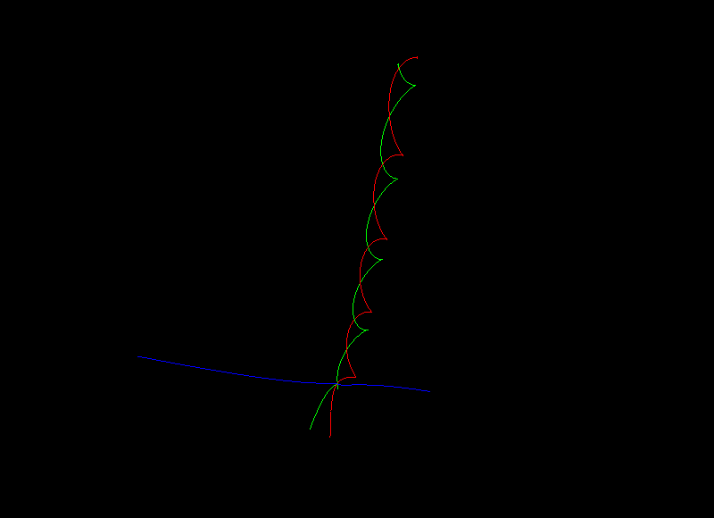
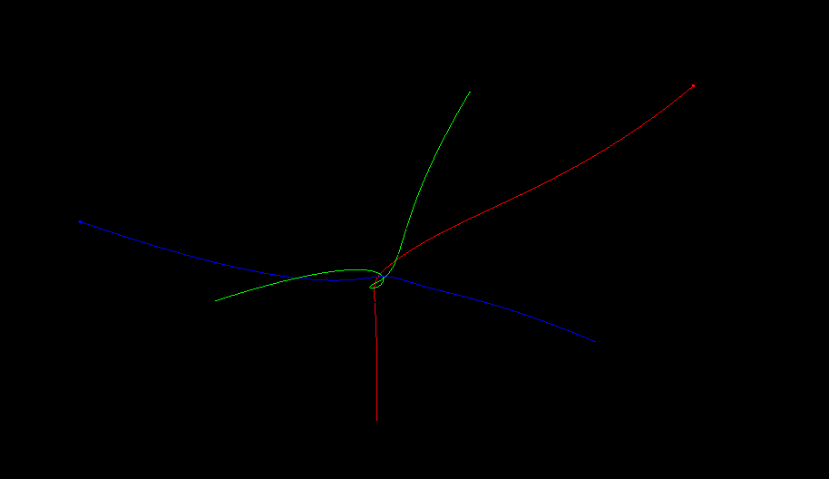
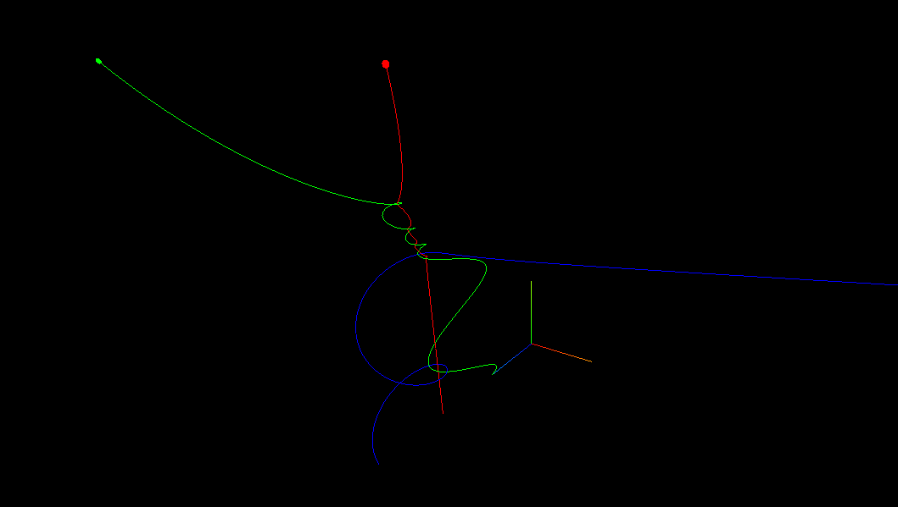

# Interactions between bodies in Newtonian space

A simple representation of interactions between bodies with a mass in Newtonian space.

To run: opening the index.html file will probably cause a CORS error from your browser. Simplest way to run it is then to start a http server with `python3 -m http.server` in the root folder of the project, then go to http://localhost:8000/

Done with three.js, some math and physics. For this "model" I have translated SI units into proprietery units.

- 1 um (unit mass) is equal to the mass of the Earth

- 1 ud (unit distance) is equal to the distance from Eath to the Sun

Pluggin these into G, we get:

Which is a good enough estimation for our needs.

This simulation usses a time step 10 seconds. This isn't the ratio of real to simulated time, but the finite detail of the system. In a perfect system this would be close to 0.

The inner workings are quite simple: on every update calculate the force vector of each body in relation the each other body, add these up to get a total force vector, get the acceletariont from that and update the speed and position.

The 2 big equations that are needed here are:

- Newton's law of universal gravitation

- Newton's Second Law of Motion

!!!Big man Newton!!!

There are some controlls in place:

- s to start/stop simulation
- m to hide/display axes helper
- +/- to increase/decrease timestep

Here are some screenshots. If you want to recreate them, the settings are saved in presets.js. Have fun!

#2

#3

#4

!! Known problem: When two bodies collide (or should collide, since the model dosen't simulate collisions) they end up shooting in diferent directions due to the r from the Universal Attraction Law equation being close to 0, resulting in a giganting force.
